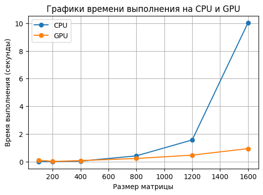
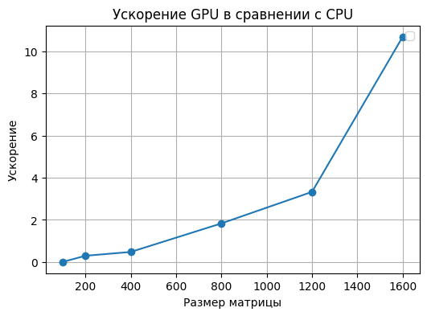

# Задание
### Перемножение матриц
**Задача:** реализовать алгоритм перемножения матриц  
**Язык:** C++ или Python  
**Входные данные:** 2 матрицы размером от 100х100 до 2000х2000 каждая  
**Выходные данные:** проверка корректности перемножения + время вычисления  
Реализация должна содержать 2 функции перемножения матриц: на CPU и на GPU с
применением CUDA.

# Отчет о проделанной работе, Сенько Никита, 6132
Лабораторная работа была реализована на языке Python в Jupyter notebook.

Умножение на CPU производилось с помощью операции dot, встроенной в библиотеку numpy и реализующую векторное перемножение матриц.

Умножение на GPU использует CUDA и выполняет вычисления на графическом процессоре. CUDA-ядро распараллеливает вычисления и распределяет обработку элементов матрицы между потоками GPU. Каждый поток обрабатывает отдельный элемент матрицы благодаря использованию сетки и блоков. Благодаря этому удается получить выигрыш по времени, в особенности для матриц большого размера. 

# Результаты эксперимента и вывод
Замеры проводились для следующих размеров матриц (100, 200, 400, 800, 1200, 1600). Результаты замеров можно увидеть в таблице ниже:
| Размер матрицы | Время на CPU | Время на GPU | Ускорение | Корректность | 
|----------------|--------------|--------------|-----------|--------------|
| 100            | 0.000950     | 0.112969     | 0.008406  | True |
| 200            | 0.002992     | 0.010003     | 0.299089  | True |
| 400            | 0.036901     | 0.076752     | 0.480781  | True |
| 800            | 0.416886     | 0.227393     | 1.833327  | True |
| 1200           | 1.566829     | 0.470745     | 3.328404  | True |
| 1600           | 10.035217    | 0.939537     | 10.681029 | True |

Видно, что с увеличением размеров матрицы ускорение начинает расти. При этом на малых размеров мы не получаем сильного выигрыша по времени, так как затраты на распараллеливание выше, чем выигрыш от него.

Ниже приведены графики времени работы на CPU и GPU и график ускорения:

**Вывод:** Использование GPU в данной задаче целесообразно для работы с большими размерами матриц, так как для маленьких затраты по времени на распараллеливание больше, чем выгода от распараллеливания.
