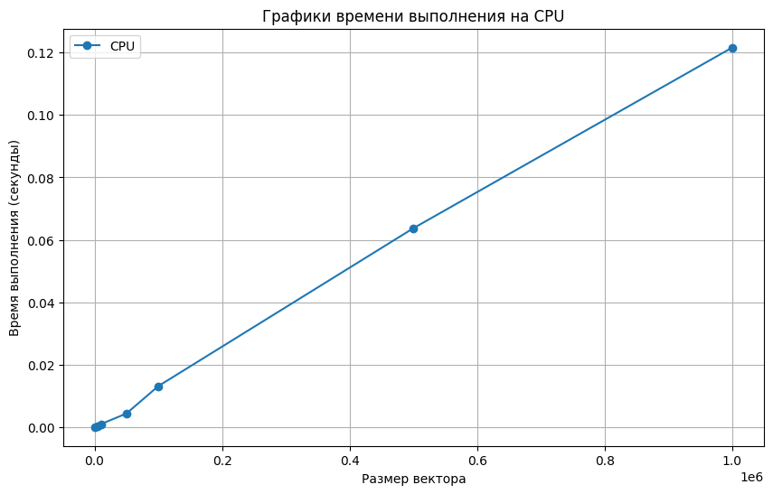
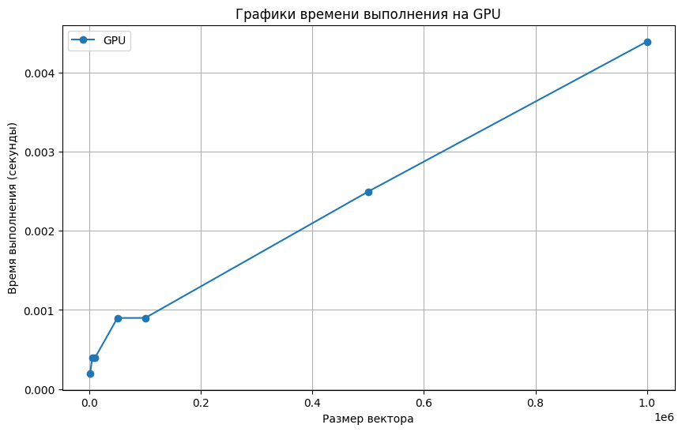
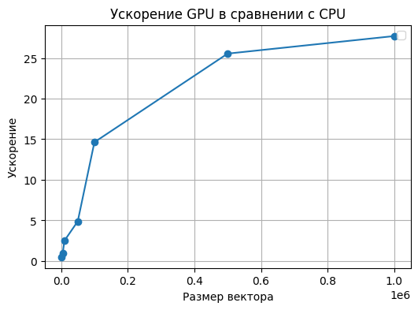

# Задание
### Сумма элементов вектора
**Задача:** реализовать алгоритм сложения элементов вектора  
**Язык:** C++ или Python  
**Входные данные:** Вектор размером 1 000...1 000 000 значений  
**Выходные данные:** сумма элементов вектора + время вычисления  
Реализация должна содержать 2 функции сложения элементов вектора: на CPU и на GPU с применением CUDA.

# Отчет о проделанной работе, Сенько Никита, 6132
Лабораторная работа была реализована на языке Python в Jupyter notebook.

В программе реализован расчет суммы элементов вектора на CPU. 

Расчет на GPU происходит с использованием библиотеки cupy для использования возможностей CUDA.
Копия вектора из CPU передается на GPU, подсчитывается сумма элементов вектора с помощью функции sum, результат передается обратно на CPU.
Элементы вектора задаются рандомно. Для каждой размерности время расчитывалось, как среднее по 10 запускам.
 

# Результаты эксперимента и вывод
Замеры проводились для следующих размеров векторов (1000, 5000, 10000, 50000, 100000, 500000, 1000000). Результаты замеров можно увидеть в таблице ниже:
| Размер матрицы | Время на CPU | Время на GPU | Ускорение |
|----------------|--------------|--------------|-----------|
| 1000           | 0.000100     | 0.000199     | 0.500299  |
| 5000           | 0.000499     | 0.000299     | 1.666507  |
| 10000          | 0.001097     | 0.000399     | 2.750583  |
| 50000          | 0.004886     | 0.000799     | 6.117127  |
| 100000         | 0.010295     | 0.000876     | 11.757399 |
| 500000         | 0.056353     | 0.002790     | 20.196107 |
| 1000000        | 0.094849     | 0.004482     | 21.161397 |

С увеличением размера вектора ускорение начинает кратно расти. При этом при 1000 элементах, наоборот, время на CPU меньше, так как много времени тратится на создание параллельных потоков.

Ниже приведены графики времени работы на CPU и GPU и график ускорения:

**Вывод:** В данной задаче расчет суммы на GPU выгоден уже начиная с 5000 элементов, что означает, что использование параллельных потоков выгодно, в особенности для больших данных.
